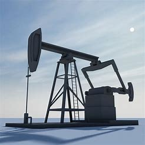
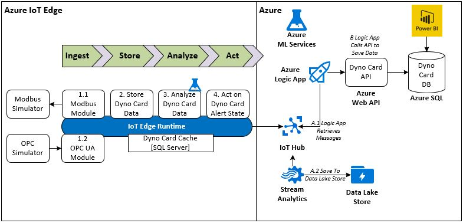

# iot-edge-dynocard

## Business Problem
Sucker pumps are a a mainstay of many oil companies.  They run continually, extracting oil from wells in remote areas of the world.



Oil and Gas companies want to operate the sucker pumps in an efficient, safe and environmentally responsible manner.  Companies use dynamometers (dyno) surveys to determine the condition of the pump operating beneath the ground or downhole.  Medium to large oil companies can have thousands of these pumps scattered throughout remote areas of the world.  It is very costly to inspect thousands of Dyno Cards individually.

A technology solution can be implemented to detect issues with the pump using data points captured from the Dyno Card, capture historical data, potentially stop the pump and alert field technicians.

## Business Solution Demo
The goal of this Dyno Card demo is to show how Azure technologies can be applied to meet this challenge.  Azure IoT Edge technologies will be applied to:

```
1. Detect issues at the edge
2. Send both immediate and historical dyno card messages to the cloud.  These messages can used to issue alerts.
3. Visualize both the surface and pump card
```

## Technical Solution
This github repo demostrates how to utilize:

```
1. Azure IoT Edge modules to retrieve Dyno Card data using both Modbus and OPC Server interfaces
2. Save Dyno Card data to a local SQL Server Data Store
3. Azure ML to detect issues with Sucker Pumps
4. Azure IoT Edge to send messages to IoT Hub
5. Use a Stream Analytics Jobs to save data to an Azure Data Lake
6. Use a Logic App to save data through a Web API into a database
7. User Power BI to visualize the Dyno Card data
```



The [Wiki](https://github.com/BlueMetal/iot-edge-dynocard/wiki) contains more information about each of the individual portion of this demo.