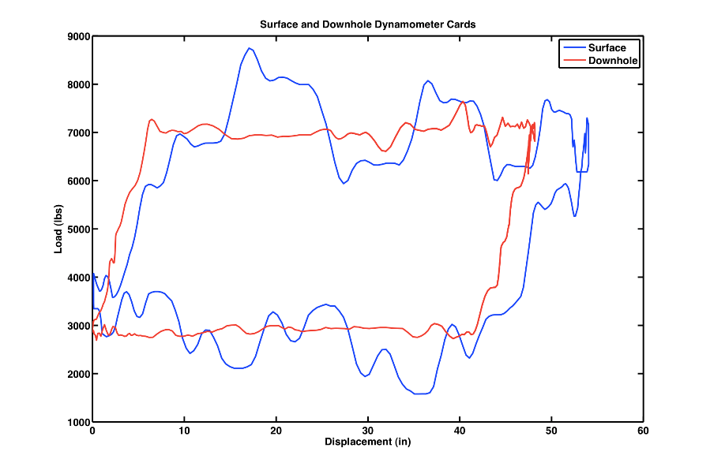
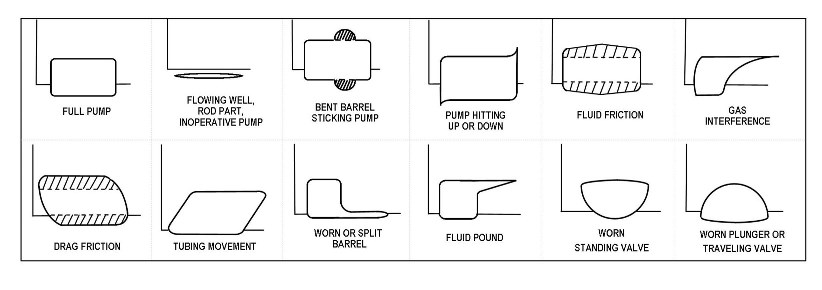
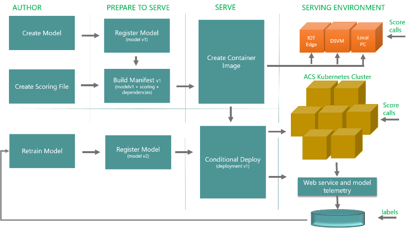
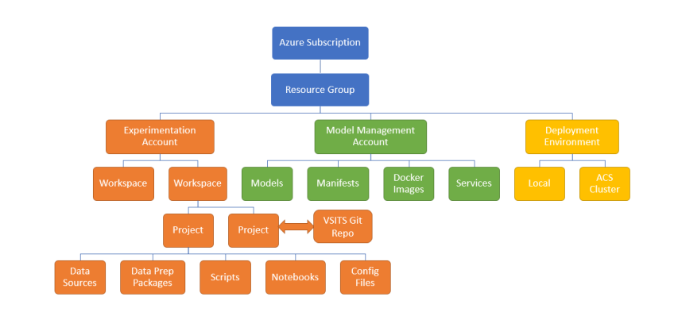

# Predicting Pump Maintenance

This is a sample predictive maintenance project using the Azure Machine Learning Services which is still in preview.  The document goes over the following topics.

```
1 - AML Experimentation Account
2 - AML Model Management Account
3 - AML Workbench
4 - Configuring the various ML objects.
5 - Training and deploying a sample model.
```


## Business Problem
The oil industry has been using the downhole sucker rod pump for a long time.  Many of the oil wells are situated in remote locations that are hard to get to.  It is not fessible to inspect these pumps on monthly rotation.  How can you determine when your sucker rod pump needs maintenance?


## Business Solution
A dynometer is a instrument used in sucker-rod pumping to record the variation between the polished rod load and the polished rod displacement. [Oilfield Glossary](http://www.glossary.oilfield.slb.com/en/Terms/d/dynamometer.aspx)  There are two types of graphs (cards) that can be plotted from the data.
The surface card is the raw plotting of the dynometer data.  The pump card is a plot of the data after it has been manipulated by a wave equation.  

The image below is a sample plot of the surface and pump cards using mathlab.



## Classification Problem

Using an old cliche, a picture is like a million words.  The shape of the pump card can be used to classify the pump as normal or abnormal.  Any pictures that do not look like a full pump require some type of maintenance.  There are a couple different machine learning algorithms that can be used to solve this [clasification](https://en.wikipedia.org/wiki/Statistical_classification) problem.
I leave the craftying of the machine learning model (secret sauce) up to you.  

How can we automate this type of classification?



## Azure Machine Learning
The new model management tools from Microsoft allow you to create projects (experiments), register a model (versioning), design a container manifest (packing), build a Docker container image, deploy the container to suitable compute platform, and collect runtime telemetry of scoring.  Right now, python is the data science language of choice.  Models can be executed locally within the workbench or remotely using either Docker or Spark.

In short, this new environment is a great leap forward to productionalizing Machine Learning.  The diagram below show the SDLC for machine learning.




## Scoring Location
Moving the predictive maintenance model to an IOT Edge node allows the scoring to happen on real time basis.  In our case, we will be classifying the pump card into one of the twelve different categories.  Any category that does not represent a normal state will send an alarm to the IOT Hub.  Thus, the amount of traffic between the edge node and the Azure IOT Hub will be minimal.

## Sample Data
I would like to thank Kimberly Martinez and Robert Cutler from Sandia National Laboratories for providing sample data.  This data was collected during 1996 for the [Downhole Dynameter Database](http://www.sandia.gov/media/dynamo.htm).

I have included four dynometer cards as sample data.  Each card is comprised of both a surface and pump cards.  There are eight header records and fifteen hundred detailed records.

Please see the following comma seperated value data sets in the data preparations section of the work bench.


```

# Four dynometer readings, one surface and one pump card each
dyno-card-headers

# Surface cards have 100 data points and pump cards have 275 data points
dyno-card-details

```

## Local Windows Setup
The following steps should be executed to create a local working environment on your laptop.


1 - Login into the Azure Portal using a valid subscription.  Create new machine learning experiment and model management accounts.  Please see the top of this [quick start](https://docs.microsoft.com/azure/machine-learning/preview/quickstart-installation) tutorial for details. 

2 - Install and log into the Azure Machine Learning workbench.  Please see the middle of this [quick start](https://docs.microsoft.com/azure/machine-learning/preview/quickstart-installation) tutorial for details. 

3 - Create a local working directory named "c:\ml-work-bench\".

4 - Unzip the project file into the "dyno-card" sub directory.

5 - Install docker for windows using the following  [install link](https://docs.docker.com/docker-for-windows/install).  Make sure linux type containers are the default type.

## Azure Subscription Setup
It is important to have the correct subscription associated with the Azure Machine Learning workbench.  The Azure Command Line (CLI) interface can be accessed via the file, open command prompt menu option in the workbench application.  The following commands can be very helpful.

```
# authenticate device -> login code & email account
az login

# list subscriptions -> associated with email account
az account list -o table

# set current subscription -> particular id 
az account set -s <enter your sub id here>

# verify default subscription -> where work will happen
az account show
```

I am including a [link](https://docs.microsoft.com/en-us/azure/machine-learning/preview/model-management-cli-reference) to the Azure CLI documentation for machine learning.  Many of the tasks involve executing these commands.

## List Environment Components
The Azure Machine Learning workbench depends upon the Ananconda version of python, the python packages and azure command line interface.  The first two components are used by the workbench environment when you run a local experiment.  The Azure Command Line Interface (CLI) is used to manage objects that are part of Azure Machine Learning.

The following commands might be helpful when debugging this preview offering.


```
# location of anaconda env
conda env list

# list python packages
pip freeze

# versions of cli components
az -v

# all cli cmds for machine learning
az ml -h
```

The image below shows the hieraching of objects that are part of Azure Machine Learning architecture.  




## Local Python Execution
In it's simplest form, a machine learning can be broken down into two programs: train and score.  The training program is used to read in data, choose a machine learning algorithm, train the algorithm with some data, determine the accuracy of the alogrithm and save the model for future reuse.  Run the following Azure CLI commands from the workbench command prompt to train your first model.  

```
# change directory
cd C:\ml-work-bench\dynocard-demo

# run experiment local
az ml experiment submit -c local train4dc.py
```

I am using a classic machine learning problem as our model to train since we do not have enough sucker pump data to train a real model.  It is up to you to supply the secret sauce to solve the pump problem.  Now back to this classic example.  There is a correlation between height, weight, shoe size and gender.  The support vector machine, part of the sci learn package, can be used to train a classification model for our data.

Jobs that are submitted thru Azure ML have telemetry.  Run time of the job, any files created, and program output can be viewed.  Go into the project workspace and find the jobs icon on the left.  It looks like a clock running backwards.  Drill into the most recent execution of the program.  The output of the job contains a model file called model4dc.pkl.  Download this file and save it into our working directory.  We will use this file later when creating a docker container or web service.

The image below shows where to download the file from the run (job) details screen.


Let us take a quick peek at the standard output (stdout) from the python training program.  This output is located in the driver log.  We can see the model was trained and saved to the outputs directory.  Then the model was reloaded to score a new data set.


The next step is to design and execute a scoring program.  The scoring program will be receiving a json message from a dynometer device using the modbus protocol.  See below for sample input message.

```
{
  "Id": 0,
  "Timestamp": "2018-04-04T22:42:59+00:00",
  "NumberOfPoints": 400,
  "MaxLoad": 19500,
  "MinLoad": 7500,
  "StrokeLength": 1200,
  "StrokePeriod": 150,
  "CardType": 0,
  "CardPoints": [{"Load": 11744,"Position": 145}]
}
```

The scoring program is a little more involved than the training program since we have to do the following:  create an init() and run() functions for the web service, and create a main() function to output a swagger document.  Swagger documents are used by Rest Web Services to document inputs.


The following commands submits the score program for local execution.

```
# change directory
cd C:\ml-work-bench\dynocard-demo

# run experiment local
az ml experiment submit -c local score4dc.py
```

Again, we want to save the swagger output file named service_schema.json to our current working directory.


Let us take a quick peek at the standard output (stdout) from the python scoring program.  The id and timestamp of the message are considered a primary key.  The output is the classification of the pump card and whether or not it is an abnormal state.


## Azure Accounts
Azure machine learning uses two accounts.  The first account keeps track of the experiments and the second account keeps track of the models.  The Azure CLI commands below can be used to validate your accounts.  In my case, my model account is named mmact4pumps and resides in the rg4pumps resource group.

```
# show experimentation acct
az ml account experimentation list

# show model management acct
az ml account modelmanagement list

# set account
az ml account modelmanagement set -n mmact4pumps -g rg4pumps
```


## Deployment Configuration
Before we can register a model, design a manifest, craft a docker container and execute the container on a local or remote compute system, we need to setup the environment.  There are several choices that we can make.  It can be a ACS cluster with Kubernetes as the orchestrator or a local docker container environment.  Please see Microsoft [documentation](https://docs.microsoft.com/en-us/azure/machine-learning/preview/deployment-setup-configuration) for more information.

The Azure CLI commands below create an local environment named dev4ex using the dev4rg resource group.  This might take some time to deploy the objects associated with the environment.

```
# create dev environment
az ml env setup -l eastus2 -n dev4ex -g dev4rg --debug --verbose

# show the progress
az ml env show -g dev4rg -n dev4ex

# set as default
az ml env set -g dev4rg -n dev4ex

# show default
az ml env show
```

The image below shows a successfully deployed local compute environment.


## Registering providers
The various deployment environments that you defined have to have the following providers registered.  Change the word "register" to "show" in the code below to examine the status of each commands execution.  All Azure CLI commands should be executed via the commmand prompt launched from the AML workbench.

```
# register providers
az provider register -n Microsoft.MachineLearningCompute
az provider register -n Microsoft.ContainerRegistry
az provider register -n Microsoft.ContainerService
```


## Local Docker Execution
Make sure that you installed Docker for windows and are running linux containers.  To execute our training program using local docker containers, run the following commands.

```
# change directory
cd C:\ml-work-bench\dynocard-demo

# run experiment local
az ml experiment submit -c docker train4dc.py
```

More than likely, this command will fail.  That is because no local image exists in docker to run the program.  Make sure you are in the dyno-card project directory.  Edit the docker.runconfig file in the aml_config sub directory.  Make sure the "PrepareEnvironment" flag is set to true.  Re-run the previous commands.  This is take some time since it has to build a local image from scratch by downloading components from Azure.  

Run the following docker command to see the new image being built.  Enclosed is a [link](https://docs.docker.com/edge/engine/reference/commandline/docker/) to the on-line documentation.  This is a valuable resource when managing local containers.

```
# list processes
docker ps -a
```

The image below shows the [conda](https://conda.io/docs) open source package management system being used to configure the container.


Run the following docker command to see installed containers. 

```
# list images
docker images
```

The image below shows a base spark image and a configured image for our experiment.


## Web Service Deployment
There is one command that can be used to register the model, create the container manifest, build the container, and deploy the web service.  Run the following statements from the command prompt opened by the AML workbench.

```
# change directory
cd C:\ml-work-bench\dynocard-demo

# create the manifest, image and service
az ml service create realtime -m model4dc.pkl -f score4dc.py -r python –n websvc4dc
```

After this command completes, we have a scoring web service running in a docker container.  Run the following docker command to see web service.  

```
# list processes
docker ps -a
```


## Testing Web Service
The run command which is part of the realtime service module can be used to call the web service.  Do not forget to call the service with -i for the service name and -d for the JSON document.  Since this is being called from the command line, all quotes have to be escaped.

```

az ml service run realtime -i websvc4dc -d "{ \"Id\": 0, \"Timestamp\": \"2018-04-04T22:42:59+00:00\", \"NumberOfPoints\": 400, \"MaxLoad\": 19500, \"MinLoad\": 7500, \"StrokeLength\": 1200, \"StrokePeriod\": 150, \"CardType\": 0,\"CardPoints\": [{\"Load\": 11744,\"Position\": 145 }] }"

```

You should see the following output from the above command.  The current python program randomly throws an anomaly 5 percent of the time.  The classification of the anomaly is randomly selected from the 11 bad categories.  The image below shows a good scoring from the sample data.


## Container Registry Information
The steps to deploy the container are listed in the IOT Hub documentation included in this project.  However, you should know where to find the end point for the version of the docker image you want to deploy as well as the access credentials.

There should be two resource groups for the local environment that you deployed.  I consider this a preview bug.  The service created a resource groups named dev4rg and dev4rg-azureml-b3770 .  This name might vary depending on your deployment.  The container registery is under the resource group that you did not name.  First, let us grab the usre name and keys.

Record the user name and password key from the following screen in the Azure Portal.


The second piece of the puzzle is the end point.  This information is under the repository blade, given the web service name, and version tag.  Record the endpoint which is listed under the Manifest title.  See image below for details.


## Summary
The oil industry has been using the downhole sucker rod pump for a long time. The dynamoter instrument can collect pump card data which can be used to classify the data as normal or abnormal.  In fact, there are eleven known categories of potential defects.

The new model management tools from Microsoft allow you to create projects (experiments), register a model (versioning), design a container manifest (packing), build a Docker container image, deploy the container to suitable compute platform, and collect runtime telemetry of scoring.  Right now, python is the data science language of choice.  Models can be executed locally within the workbench or remotely using either Docker or Spark.

Today, we crafted sample training and scoring programs using the AML workbench.  A web service was deployed and tested in a local docker container.  Last but not least, container registry information was collected to deploy the image to the IOT Hub as a edge node.